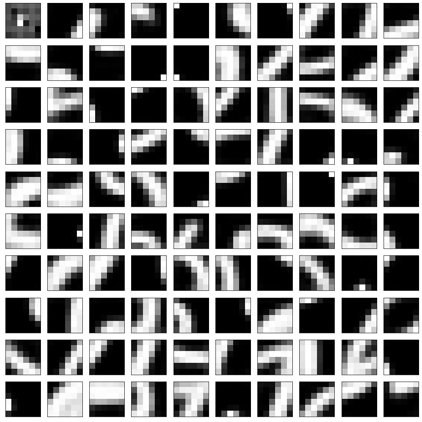

# 实验3 论文实现报告-nbgao

#### 作者: 高鹏昺
#### 邮箱: nbgao@126.com

## 1. 论文介绍
**论文标题: [An Analysis of Single Layer Networks in Unsupervised Feature Learning](https://ai.stanford.edu/~ang/papers/nipsdlufl10-AnalysisSingleLayerUnsupervisedFeatureLearning.pdf)**
**论文作者: Adam Coates, Honglak Lee, Andrew Y. Ng**
**发表时间: 2011 AISTATS(Artificial Intelligence and Statistics)**

## 2. 主要方法
本论文的核心工作是使用无监督方法对图像数据集进行特征学习,然后通过提取图像特征,进行分类任务.
论文中特征学习的方法主要应用了以下4种:
1. 稀疏自编码器(sparse antu-encoders)
2. 稀疏玻尔兹曼机(sparse RBMs)
3. K-means聚类(K-means clustering)
4. 高斯混合模型(Gaussian mixtures)
   
论文中用于图像分类任务实验的数据集为NORB和CIFAR.

### 第1阶段 特征学习
特征学习主要包括了子块采样阶段,子块预处理阶段和无监督特征表示学习阶段.
#### (1) 子块采样阶段
对于每幅图像随机提取$m$个子块(sub-patch),每个子块的尺寸为$w \times w$且通道数为$d$.获得采样子块集合$X=\{x^{(1)},\cdots,x^{(m)}\}$,每个块(patch)用$x^{(i)} \in \mathbb R^N$,其中$N=w \times w \times d$.

#### (2) 子块预处理阶段
1. 对所有采样的子块进行**标准化(Standardization)** (论文中是用正则化Normalization表示,标准化是其中的一种方法).标准化公式如下:
$$ x_{ij}^{'} = \frac{x_{ij}-u}{\sigma}$$
其中,$x_{ij}$表示每个子块$i$行$j$列的像素值,$u$表示每个子块内像素的平均值,$\sigma$表示每个子块内像素的标准差.

1. 经过标准化后的所有子块可以选择性地使用**白化(whitening)** 操作.关于这个操作论文中没有细致介绍其原理,可以参考[其他资料](https://my.oschina.net/findbill/blog/543485).
   
#### (3) 无监督特征学习阶段
无监督学习算法作为一个"黑盒"利用数据集X和输出函数$f:\mathbb R^N \rightarrow\mathbb R^K$,该函数映射了输入子块向量$x^{(i)}到新的$K$维特征向量$,其中$K$为无监督算法的参数(K-means方法中表示聚类数).第$k$个特征用$f_k$表示.
论文中的无监督学习方法包括了4种:稀疏自编码,稀疏RBMs,K-means聚类和高斯混合模型.
这里我们重点关注其中的**K-means聚类算法**.
在特征学习阶段K-means聚类算法用来从输入数据学习$K$个中心(centroids),第$k$个中心用$c^{(k)}$表示.
给定学习到的中心$c^{(k)}$,论文给出了2种特征映射$f$.
1. 硬分配编码法(独热编码one-hot)
   即与中心点距离最近的元素对应的$f_k$置为1,其余的置为0.
$$
f_k(x)=
\begin{cases}
1& \text{if } k=argmin_j\|c^{(j)}-x\|_2^2\\
0& \text{otherwise}
\end{cases}
$$
2. 基于triangle激活函数的soft软编码非线性映射
这里的soft是指一定的"松弛性",即每个小于平均距离的元素对应的$f_k$置为与均值的差值,其余的置为0.
$$f_k(x)=max\{0,u(z)-z_k\}$$
其中,$z_k=\|c^{(j)}-x\|_2^2$表示元素与第$k$个中心的距离,$u(z)$表示$z$的均值.

### 第2阶段 特征提取
利用大小为$w$的感受野在图像上均匀滑动采样,滑动步长为$s$,从而得到$(\frac{n-w}{s}+1)\times (\frac{n-w}{s}+1) \times K$个提取到的特征子块,每个特征子块值为该子块与各个特征中心的距离.
然后,通过4象限池化卷积的方法将每个图像样本$(\frac{n-w}{s}+1)\times (\frac{n-w}{s}+1) \times K$数量降到$ 2\times2 \times K $.
最后,将4象限的4个向量展平拼接得到每个图像样本$4K$维度的特征向量.

### 第3阶段 图像分类

论文中采用的分类器是标准线性分类算法,实验中使用了L2正则化的SVM分类器进行分类.
分类器输入的每个样本是池化后展平的$4K$特征维向量和对应标准线性分类算法的类别标签.然后将训练后的分类器模型对测试特征向量,进行预测对应的类别标签.实验中的结果准确率是通过交叉验证(cross-validation)来评分的.

## 3. 论文实验及结果
实验中主要4种参数可以变化:
1. 是否使用白化(whitening)操作
2. 特征的数量K
3. 感受野滑动步长s(stride)
4. 感受野的尺寸w

另外,针对K-means聚类算法还有soft和hard两种特征映射方法可选择.

论文的实验结果表明:
1. 对于K-means聚类算法,由于其对数据相关性的不可见,**白化操作**是一种关键的预处理方法.
2. 经过100,200,400,800,1200,1600不同特征表示数(即聚类后的中心数)下的实验比较:**特征表示数K**越大,交叉验证准确率越高.
3. 经过1,2,4,8不同**感受野滑动步长s(stride)** 下的实验比较:由于滑动距离越短,每幅图像中提取到的块越多,获得的特征信息更多,因此滑动步长s取1时,交叉验证准确率最高.
4. 经过6,8,12不同**感受野尺寸**下的实验比较:由于感受野尺寸越小,每幅图像中提取到的块也更多,因此在一定范围内感受野尺寸越小,交叉验证准确率越高(不能过小,这样每个块包含的特征信息太少).
5. K-means算法中采用triangle激活函数的soft特征映射方法要比hard特征映射方法的交叉验证准确率高出许多(5%-10%).

论文最终结论:
使用白化操作,感受野滑动步长为1像素,感受野尺寸为6像素,更多的特征数量,K-means算法采用triangle激活函数特征映射等参数方法能够在CIFAR-10数据集和NORB数据集上取得最好的测试准确率能(分别为77.9%和97.0%).

## 4. 实验实现
论文的代码实现在lab3-Paper-Implement-{1|2|3}-nbgao的ipynb文件中.具体实现请查看以上ipynb文件.
实验的方法基本按照上述的实验方法和流程.
总体的实验框架是:
[特征学习阶段] 子块随机采样 => 子块标准化 => 子块白化 
[特征学习阶段] => K-means聚类学习特征中心 => hard/soft特征映射 
[特征提取阶段] => 感受野滑动提取子块特征 => 4象限平均池化 => 特征拼接
[图像分类阶段] => 数据集划分 => 训练SVM分类器 => 预测测试集类别 => 评分计算准确率

注: 
1. 实验实现所采用的是MNIST数据集,由于实验时间有限的因素,实验中的部分参数设置并没有完全依据论文中给出的(如学习的特征数K等).
2. 由于4象限池化图像的尺寸可能为奇数,4个块的像素数不能保持一致,因此本人并未采用论文中的计算每一象限内总和的方法,而是使用了平均池化(mean pooling)的方法.计算平均值的方法其实与计算总和是等效的,且相比较计算综合的方法其不受每部分数量不一致的影响.

## 5. 实验结果
实验采用的数据集为MNSIT数据集,学习特征的数据数量分别采用了1000,5000,10000个样本.
实验中的主要参数:
* 数据集大小: data_num = 1000/5000/10000
* 单张图像采样块数: M = 10
* 采样块/感受野宽度: W = 6
* 感受野滑动步长: S = 1
* 聚类中心数: K = 500/1000

随机选取的100个聚类中心可视化结果如下:

同原论文一样本人最后同样采用了交叉验证(cross-validation)的方法来测试模型预测的准确率.本人在实验中采用的是K折交叉验证(K-fold cross-validation),其中K取10.这样便可以的到10次数据集划分的测试分数,然后即可得到10次的平均准确率.
测试结果如下:
data_num|K|M|W|S|hard/soft|Accuracy
:-:|:-:|:-:|:-:|:-:|:-:|:-:
1000|1000|10|6|1|hard|87.8%
1000|1000|10|6|1|soft|95.1%
5000|500|10|6|1|hard|94.9%
5000|500|10|6|1|soft|97.2%
10000|500|10|6|1|hard|96.1%

由以上实验结果可知在1000样本数量,1000特征中心数量下,采用了triangle激活函数的soft特征映射方法相比hard特征映射方法,交叉验证准确率高出了7.3%.
在5000样本数量,500特征中心数量下,采用了triangle激活函数的soft特征映射方法相比hard特征映射方法,交叉验证准确率高出了3.7%.
在其他参数一致的情况下,样本数量越大,交叉验证准确率越高.
注:
1. 10000样本数量,500特征中心数量,soft特征映射方法由于训练时间太长,并未进行.
2. 同样样本数量下,不同特征中心数量的对比实验由于时间有限,没有进行实验,但可以根据推测,特征中心数K越大,交叉验证准确率越高.
